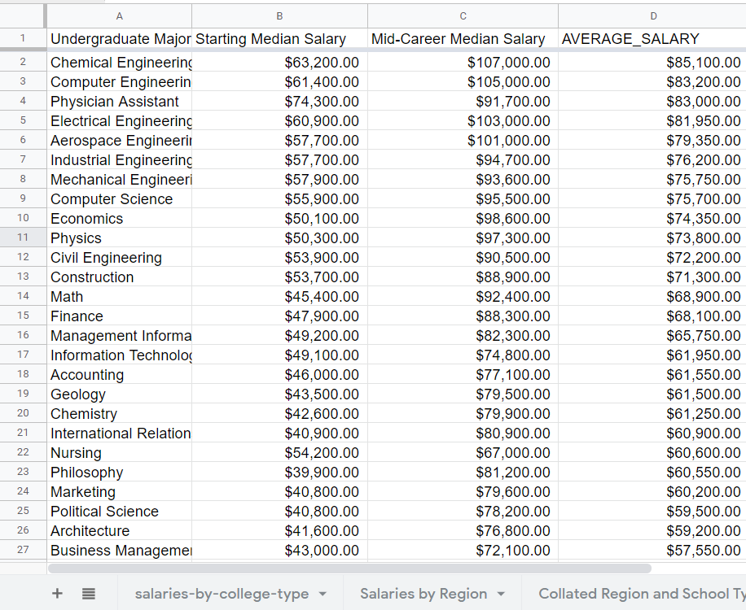
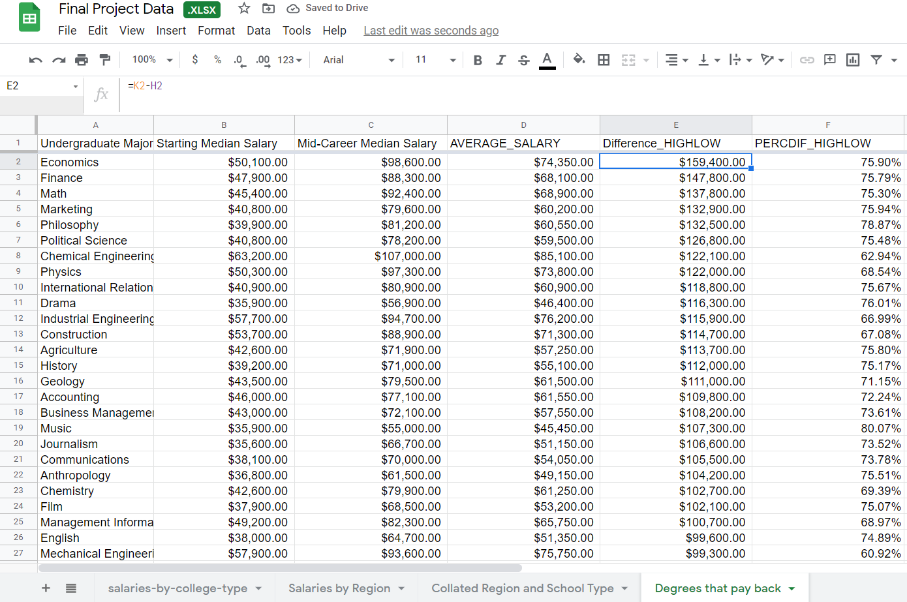
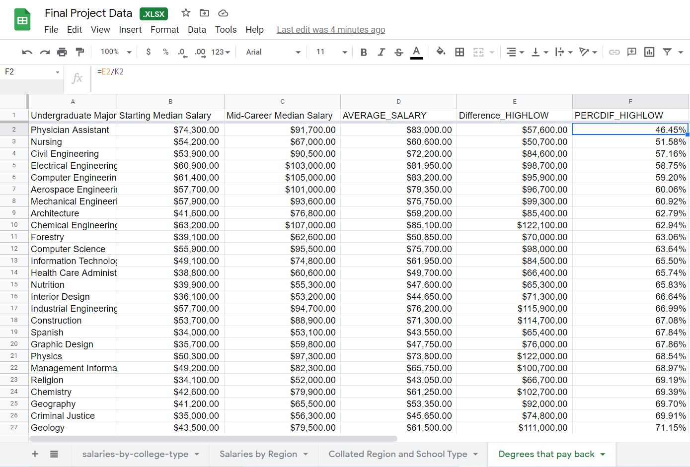
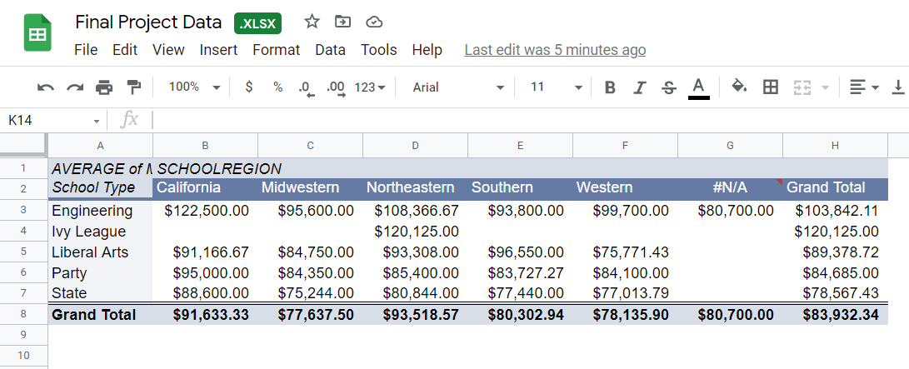
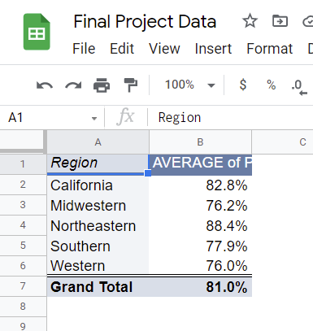
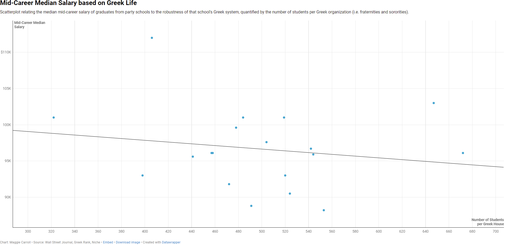

# MaggieCarroll_J124Final
Analyzing data about salaries based on degrees, college types, and college regions. 

# Data Analysis Process

## Question 1: Which are the top 5 paying majors? What are the 5 lowest paying majors? (Using average of starting and mid-career salary)
|  **Highest Paying**  |  **Average Salary**  |  **Lowest Paying**  |  **Average Salary**  |
| --- | --- | --- | --- |
| Chemical Engineering | $85,100.00 | Religion | $43,050.00 |
| Computer Engineering | $83,200.00 | Education | $43,450.00 |
| Physician Assistant | $83,000.00 | Spanish | $43,550.00 |
| Electrical Engineer | $81,950.00 | Interior Design | $44,650.00 |
| Aerospace Engineer | $79,350.00 | Music | $45,450.00 |

### How I solved this:
1. In the "Degrees that pay back" sheet, make a new column called "AVERAGE_SALARY"
2. Find the average of "Starting Median Salary" and "Mid-Career Median Salary" - AVERAGE(B2, C2) and apply to column
3. Sort from highest to lowest to find the top-paying majors
4. Sort from lowest to highest to find the lowest-paying majors

## Question 2: Which career has the greatest disparity between the highest paid and lowest paid people? 
#### This question has two different ways to answer it: either the percentage difference or actual monetary difference. For example, one career might have a greater monetary disparity between the highest and lowest paid employees, but if it pays more than another career, it could have a more narrow percent difference than another career with a lesser monetary disparity in salaries. I will solve this problem considering both these disparities.

## Based on monetary difference in salary: Economics with a disaprity of $159,400.00
### How I solved this:
1. In "Degrees that pay back" column, make a new column called "Difference_HIGHLOW"
2. Make an equation that subtracts the "Mid-Career 10th Percentile Salary" column from the "Mid-Career 90th Percentile Salary" column
3. Sort this new column from highest to lowest to find the greatest disparity

## Based on percentage difference in salary: The lowest-paid Physician Assistants make 46.45% what the highest-paid Physician Assistants make, though the difference in salary is only $57,600.00
### How I solved this: 
1. In "Degrees that pay back" column, make a new column called "PERCDIF_HIGHLOW"
2. Make an equation that finds what percentage of the highest salaries that the lowest-paid graduates make. That is "Mid-Career 10th Percentile Salary" divided by "Mid-Career 90th Percentile Salary" and apply to the column.
3. Sort this new column from lowest to highest to find the greatest disparity within individual majors. 
4. Alternatively, you could find the percentage __more__ that the highest paid group makes over the other and sort high to low and that should give the same degree as the answer.

## Question 3: How do region and school type impact salary? (look at Mid-Career Median Salary)
#### This question does not have a straightforward answer, but here are the trends that I found:

#### California and the Northeast have a higher median midcareer salary than other regions based on "Grand Total"
#### For type: state schools tend to have the lowest salary and Ivy League have the highest
#### For region: Midwestern is paid the least and Northeast is paid the most
#### The highest paying type and region is California Engineering schools. 
##### This data is definitely biased and so flawed - for instance, Stanford and USC, which both have higher than average median salaries, were not included in the "School Type" data, so could not be included in this comparison. Generally there were biases with the "School Type" with some meaningless distinctions, which I will discuss later.

### How I solved this: 
1. Create a new column called "SCHOOLREGION" in the table "salaries-by-college-type".
2. Use "VLOOKUP" to combine the tables "Salaries by Region" and "salaries-by-college-type" (i.e. "=VLOOKUP(A2, 'Salaries by Region'!$A$2:I338, 3, false)").
3. Apply to the entire column "SCHOOLREGION".
4. Go to "DATA" and create a new pivot table.
5. For column, use "School Type".
6. For row, use "SCHOOLREGION".
7. For value, use "Mid-Career Median Salary" summarized by "Average".
8. Analyze the table to find common trends. For instance, look at the "Grand Total" based on region and school type to see which make the most and/or least money. 

## Question 4: With the exception of Randolph-Macon College, all of the schools that are labeled as "Party" schools are also listed under "State" schools. How do state and party schools compare in terms of salary?
|  **Party School Mid-Career Median Salary**  |  **State School Mid-Career Median Salary** |
|  ---  |  ---  |
| $96,030 | $77,076 |

### How I solved this:
1. In a table that includes the school names and school types, filter "School Type" to just "Party" and "State"
2. Because all of the "Party" schools are also listed under other school types, sort for schools that have a duplicate. To do this, first highlight the entire "School Name" column
3. Click "Format" in the toolbar and then "Conditional Format"
4. Make sure that the applied range is the entire column
5. Under "Format cells if...", select "Custom formula is" and type "=countif(A:A, A1)>1". If "School Name" is a column other than "A", use that column in the formula. This formula will highlight any schools in the column that are listed more than once. Since only party schools are listed more than once, only they will be highlighted (alongside their duplicates). You can check this later by sorting by school type to see that only party schools and schools with the same name as party schools (all state, except Randolph-Macon, as mentioned earlier)
6. Once they are highlighted, filter "School Name" by the color that the duplicate schools are highlighted: this should give back schools that are categorized as "Party".
7. Paste this into a new table and call this "Party Schools".
8. Now, in the original table, filter "School Name" first by color so that the color is white (the default). 
9. Highlight "School Name", and under the "Data", select "Remove Duplicates", which will leave all of the party schools.
10. Then, filter the column "School Type" so that only "State" is shown. Paste all of these values into a new table called "State Schools". These values are state schools that are not *also* labeled as "Party" schools.
11. In both tables, create a row called "AVERAGE" and under "Mid-Career Median Salary", write the formula "=AVERAGE(...)", where "..." is the highlighted values of that column (i.e. E2:E21).
12. That should give the average values of the mid-career median salaries for both state and party schools!

## Question 5: Which region see the most salary growth?
### The Northeast
|  **Region**  |  **Average Percent Increase from Start of Career to Mid-Career** |
|  ---  |  ---  |
| California | 82.8% |
| Midwest | 76.2% |
| Northeast | 88.4% |
| South | 77.9% |
| West | 76.0% |

### How I solved this:
1. In the "Salaries by Region" table, make a new column called "PERC_CHANGE_FROM_START_TO_MID"
2. In the column, type the formula "=(D2-C2)/C2", where D is "Median Mid-Career Salary" and C is "Median Starting Salary"; apply to the column
3. Make a pivot table with "Region" as row, and the average of "PERC_CHANGE_FROM_START_TO_MID" as value
4. Analyze the table (recreated above)

# Story Summary and Sourcing 

###  My story pitch involves question 4, which compares the earnings of state schools and party schools, as defined by the Wall Street Journal. When I first looked at the data, the distinction of "party school" seemed classist since nineteen of the twenty schools defined as such were also public state schools, with one liberal arts school. This suprised me since some schools that were more often attended by the rich but could also be called "party schools", like USC, Tulane, or Dartmouth, were not labeled so dismissively. Upon second look, however, I was suprised to find that state "party" schools had a higher average median income than non-party state schools (see question 4). This inspired what I would want to look at, which would be **why** these schools have better paid graduates. 
###  I wondered if party schools had more robust Greek life, and if that had a correlation with higher salaries, perhaps through panhellenic networking. I looked through greekrank.com, through which I found the number of sororities and fraternities at each "party school", with the exception of Randolph-Macon College, which I omitted because it made this data less comparable to the other schools. I also went on niche.com to find the student population at each school so as to better understand the ratio of Greek organizations to the number of students. I thought that 20 Greek organizations at a school with a small student population might be more notable than a school with a similarly-sized Greek life, but a greater number of students. On the basis of this information, I divided the student population by the total number of Greek houses at a school to find the number of students per Greek house on campus. Using this information, I made the scatterplot seen below.

# Data Visualization

[Scatter Plot](https://datawrapper.dwcdn.net/HMBgw/1/)

### Based on this scatterplot, we can see that there is a slight correlation between higher salary and robust Greek life, which I define as having fewer students per one Greek house at a school. However, the correlation is slight and might be circumstantial. I would also like to look into factors like average family income by school, trends of salary amongst Greek members compared to other students, and comparisons with non-party state schools. 

#### Sources I could seek out:
* Sneha Ramesh: sneha.ramesh@berkeley.edu
  * President of the UC Berkeley Panhellenic Executive Council of 2021. Sneha would be a good person to talk to about the post-graduate connections made throuh Greek life. She is also probably more accessible being a Berkeley student, and I do happen to have met her through a mutual friend my Freshman year, which might also help if I wanted to interview her.
* Dil Sen: dilsen@berkeley.edu
  * President of the UC Berkeley Interfraternity council. Dil, like Sneha, could be a good person to talk to both because he has personal experience in a fraternity and in leadership, so he's likeley more knowledgeable than an average Greek member. Also, like Sneha, the proximity could make him a more feasible source.

#### Additional data:
* ["The impact of Greek organization membership on collegiate outcomes: Evidence from a National Survey"](https://doi.org/10.1016/j.socec.2014.02.003)
  * This report examines the impact, if any, of membership in Greek life on life after college. It includes a lot of data that could be useful in examining if Greek membership is the factor that means higher salaries amongst graduates of party schools, most especially data that says Greek members, both male and female, make more than their non-Greek counterparts. I'm curious if pre-existing family wealth or connections skews this, which would make this finding less significant, but it is an interesting lead.
* [Greek Life Statistics](https://thefraternityadvisor.com/greek-life-statistics/)
  * This article goes over some statistics about fraternity life, with a lot of class-related statistics being pretty blatant. For instance, as of 2011, when this was written, 85% of Fortune 500 executives were fraternity men and 40 of 47 Supreme Court Justices were fraternity men. This could be interesting to look into, and might be a lead that shows fraternity membership as a class status marker.
